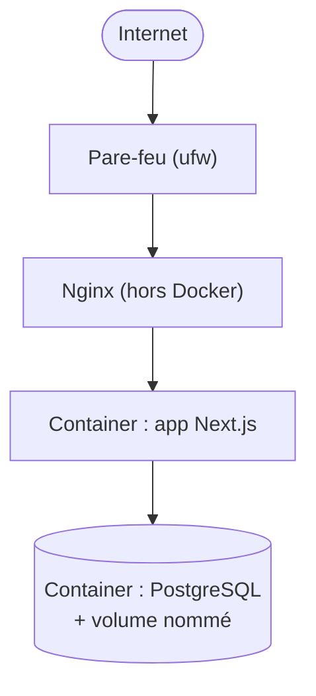

# Chapitre 21 — Étude de cas : Next.js + Prisma + Docker

**Niveau : Intermédiaire → Avancé**

---

## Introduction

Cette étude de cas change deux dimensions à la fois par rapport au chapitre 19 : le framework devient Next.js (rendu serveur, chapitre 6 section 6.5) et le mode de déploiement passe de l'installation directe à une conteneurisation complète via Docker Compose (chapitres 7 et 8). C'est la première étude de cas de ce manuel entièrement conteneurisée, servant de patron pour toutes celles qui suivront sur le même principe.

## 🎯 Objectifs pédagogiques

Déployer une application Next.js avec Prisma et PostgreSQL, entièrement via Docker Compose, du serveur vierge à la production HTTPS.

## 📋 Prérequis

Chapitres 4, 7, 8, 9, 10 (serveur, Docker, Compose, nginx, SSL). Chapitre 6 section 6.5 (Next.js).

## Pourquoi ce chapitre est important

Beaucoup de projets modernes choisissent Docker dès le départ plutôt que l'installation directe — ce chapitre est la démonstration complète de ce chemin alternatif, déjà annoncé comme "tout aussi valide" depuis le chapitre 6.

---

## Contexte du projet

**Brief.** Un cabinet comptable veut un tableau de bord interne (rendu serveur pour des raisons de référencement d'une partie publique du site, et de sécurité pour la partie privée), avec des données persistées via Prisma/PostgreSQL. L'équipe technique préfère une stack entièrement conteneurisée, plus simple à reproduire sur les postes de chaque développeur.


**Explication du diagramme :** nginx reste **hors** de Docker (chapitre 9, installé directement sur le système) — un choix assumé pour garder la gestion des certificats Certbot aussi simple qu'aux chapitres précédents. Seule l'application et sa base sont conteneurisées.

---

## Explications détaillées : le déroulé complet

### 21.1 Préparer le serveur et installer Docker (chapitres 4, 5, 7)

Identique au chapitre 19, section 19.1, en remplaçant l'installation de PostgreSQL/Node direct par :
```bash
curl -fsSL https://get.docker.com -o get-docker.sh
sudo sh get-docker.sh
sudo usermod -aG docker $USER
# se déconnecter/reconnecter
sudo apt install nginx -y
sudo apt install certbot python3-certbot-nginx -y
```

### 21.2 Cloner le projet et écrire le Dockerfile

```bash
ssh-keygen -t ed25519 -C "serveur-cabinet"
git clone git@github.com:tonorg/cabinet-dashboard.git ~/app
cd ~/app
```
```dockerfile
# Dockerfile
FROM node:22-alpine AS builder
WORKDIR /app
COPY package*.json ./
RUN npm ci
COPY . .
RUN npx prisma generate
RUN npm run build

FROM node:22-alpine
WORKDIR /app
COPY package*.json ./
RUN npm ci --omit=dev
COPY --from=builder /app/.next ./.next
COPY --from=builder /app/public ./public
COPY --from=builder /app/prisma ./prisma
COPY --from=builder /app/node_modules/.prisma ./node_modules/.prisma
EXPOSE 3000
USER node
CMD ["npm", "start"]
```
> 📌 **À retenir** — Prisma génère un client spécifique à chaque build (`npx prisma generate`), qui doit être recopié explicitement dans l'étape finale du multi-stage build (chapitre 7, section 7.4) — un oubli fréquent qui casse l'application au démarrage avec une erreur Prisma peu explicite.

### 21.3 Écrire le `docker-compose.yml`

```yaml
services:
  app:
    build: .
    ports:
      - "127.0.0.1:3000:3000"
    environment:
      DATABASE_URL: postgresql://cabinet_user:${DB_PASSWORD}@db:5432/cabinet
      NEXTAUTH_SECRET: ${NEXTAUTH_SECRET}
    depends_on:
      db:
        condition: service_healthy
    restart: unless-stopped

  db:
    image: postgres:16-alpine
    environment:
      POSTGRES_DB: cabinet
      POSTGRES_USER: cabinet_user
      POSTGRES_PASSWORD: ${DB_PASSWORD}
    volumes:
      - pg-data:/var/lib/postgresql/data
    healthcheck:
      test: ["CMD-SHELL", "pg_isready -U cabinet_user"]
      interval: 5s
      timeout: 5s
      retries: 5
    restart: unless-stopped

volumes:
  pg-data:
```
`ports: "127.0.0.1:3000:3000"` — rappel du chapitre 13 (sécurité des ports internes) : le port de l'application n'est publié que sur l'interface locale, jamais directement sur Internet ; c'est nginx, hors Docker, qui expose réellement le service au public.

```bash
echo "DB_PASSWORD=$(openssl rand -hex 16)" > .env
echo "NEXTAUTH_SECRET=$(openssl rand -hex 32)" >> .env
docker compose up -d --build
```

### 21.4 Migrations Prisma dans un contexte Docker

```bash
docker compose exec app npx prisma migrate deploy
```
**Ce que fait cette commande :** exécute la migration **à l'intérieur** du container `app` déjà en cours d'exécution, avec le `DATABASE_URL` qu'il connaît déjà (pointant vers `db`, le nom du service) — même logique que le chapitre 8, section 8.6, appliquée à Prisma spécifiquement.

### 21.5 Nginx en reverse proxy vers le container (chapitre 9)

```nginx
server {
    listen 80;
    server_name cabinet.tondomaine.ht;

    location / {
        proxy_pass http://localhost:3000;
        proxy_set_header Host $host;
        proxy_set_header X-Real-IP $remote_addr;
        proxy_set_header X-Forwarded-For $proxy_add_x_forwarded_for;
        proxy_set_header X-Forwarded-Proto $scheme;
    }
}
```
```bash
sudo ln -s /etc/nginx/sites-available/cabinet /etc/nginx/sites-enabled/
sudo nginx -t && sudo systemctl reload nginx
sudo certbot --nginx -d cabinet.tondomaine.ht
```

### 21.6 Sauvegardes de la base conteneurisée (chapitre 12, section 12.9 adaptée)

```bash
nano ~/scripts/backup-db.sh
```
```bash
#!/bin/bash
set -e
DATE=$(date +%Y-%m-%d_%H%M)
BACKUP_DIR="/var/backups/cabinet"
mkdir -p "$BACKUP_DIR"
docker compose -f /home/jaslin/app/docker-compose.yml exec -T db \
  pg_dump -U cabinet_user cabinet | gzip > "$BACKUP_DIR/cabinet_$DATE.sql.gz"
find "$BACKUP_DIR" -name "*.sql.gz" -mtime +14 -delete
rclone copy "$BACKUP_DIR/cabinet_$DATE.sql.gz" remote:Cabinet-Backups/
```

### 21.7 Redéploiement d'une nouvelle version (chapitre 8, section 8.7)

```bash
cd ~/app
git pull origin main
docker compose up -d --build
docker compose exec app npx prisma migrate deploy
```

### 21.8 Checklist finale de mise en production

- [ ] `https://cabinet.tondomaine.ht` répond en `200`, cadenas fermé.
- [ ] `docker compose ps` montre `app` et `db` "running"/"healthy".
- [ ] Le port 3000 n'apparaît jamais dans `sudo ss -tulpn` en écoute sur `0.0.0.0`.
- [ ] Une sauvegarde a été prise et restaurée sur une base de test.
- [ ] `sudo ufw status` ne montre que 22/80/443 — Docker ne doit jamais contourner cette règle (rappel du piège classique : Docker peut modifier `iptables` directement, parfois en conflit avec `ufw` — à vérifier explicitement avec `sudo iptables -L` après déploiement).

> ⚠️ **Attention, piège spécifique à Docker sur un serveur avec `ufw`** — Docker manipule directement les règles `iptables` pour publier les ports des containers, ce qui peut, dans certaines configurations, **contourner** les règles `ufw` plutôt que les respecter. Toujours vérifier après déploiement qu'un port de container n'est pas exposé publiquement malgré une règle `ufw` qui semble l'interdire — publier explicitement sur `127.0.0.1:PORT:PORT` (comme fait section 21.3) reste la protection la plus fiable, indépendante de cette interaction.

---

## Bonnes pratiques (récapitulatif du chapitre)

- Toujours publier les ports de containers sur `127.0.0.1`, jamais sur toutes les interfaces, quand nginx reste hors Docker.
- Recopier explicitement le client Prisma généré dans l'étape finale d'un multi-stage build.
- Vérifier l'interaction réelle entre Docker et `ufw` après chaque déploiement, jamais supposée sûre par défaut.

## Erreurs fréquentes (récapitulatif du chapitre)

| Erreur | Pourquoi elle arrive | Conséquence |
|---|---|---|
| Client Prisma non recopié dans l'image finale | Étape multi-stage oubliée | Erreur au démarrage du container, difficile à diagnostiquer sans ce rappel |
| Port de container publié sur `0.0.0.0` | Habitude de test local | Exposition publique non voulue, contournant potentiellement `ufw` |
| Migration exécutée hors du container | Réflexe de la ligne de commande locale | `DATABASE_URL` incorrect (pointant sur `localhost` au lieu de `db`) |

---

## Captures d'écran à réaliser

> 📸 **Capture 24**
> **Logiciel :** terminal
> **Pourquoi cette capture est utile :** confirmer visuellement qu'aucun port de container n'est exposé publiquement.
> **Page/écran concerné :** sortie de `sudo ss -tulpn` après déploiement
> **Montrer :** le port 3000 lié uniquement à `127.0.0.1`
> **Entourer :** l'adresse `127.0.0.1:3000`

---

## Laboratoire pratique n°1 — Déployer cette stack conteneurisée de bout en bout

**Objectifs :** reproduire l'intégralité de ce chapitre.
**Résultat attendu :** application accessible en HTTPS, base persistée dans un volume nommé.

## Laboratoire pratique n°2 — Confirmer la persistance après un cycle complet

**Objectifs :** vérifier que les données survivent à un redéploiement.
**Étapes :** insère une donnée de test, `docker compose down` (sans `-v`), `docker compose up -d --build`, confirme la donnée toujours présente.

## Laboratoire pratique n°3 — Vérifier l'absence d'exposition publique du port applicatif

**Objectifs :** confirmer la bonne pratique de sécurité de ce chapitre.
**Étapes :** tente une connexion au port 3000 depuis une machine externe — doit échouer malgré le fonctionnement normal du site via nginx.

---

## Exercices

1. Pourquoi le client Prisma doit-il être régénéré et recopié explicitement dans un build Docker multi-étapes ?
2. Explique le risque d'interaction entre Docker et `ufw`, et la protection recommandée dans ce chapitre.
3. Pourquoi nginx reste-t-il hors de Docker dans cette étude de cas, alors que tout le reste est conteneurisé ?

## Quiz

**Question 1.** Pourquoi publier un port de container sur `127.0.0.1:PORT` plutôt que simplement `PORT` ?
a) Ça n'a aucune importance
b) Ça garantit que le port n'est accessible que localement, jamais depuis Internet
c) C'est requis par Docker Compose
d) Ça améliore les performances

> 🔑 **Corrigé** — 1: b

---

## 📝 Résumé du chapitre

Cette étude de cas démontre le chemin entièrement conteneurisé : Next.js et PostgreSQL dans Docker Compose, nginx en reverse proxy hors Docker, avec une vigilance particulière sur l'exposition réelle des ports face à l'interaction Docker/`ufw`.

## ✅ Checklist avant de passer au chapitre 22

- [ ] J'ai déployé une stack Docker Compose complète en production, avec nginx hors Docker en reverse proxy.
- [ ] J'ai vérifié concrètement qu'aucun port de container n'est exposé publiquement.

---

## Glossaire du chapitre

**Client Prisma généré**
Définition simple : le code qui permet à l'application de parler à la base de données, généré spécifiquement pour son schéma.
Définition technique : un module JavaScript généré par `prisma generate` à partir du fichier `schema.prisma`, propre à chaque build et devant être présent dans l'image finale d'un multi-stage build.
Voir : Chapitre 21, section 21.2.

## ❓ FAQ

**Pourquoi ne pas conteneuriser nginx aussi, pour tout avoir dans Docker Compose ?**
C'est possible et fait dans certaines études de cas suivantes — le choix ici de garder nginx hors Docker simplifie la gestion des certificats Certbot, déjà maîtrisée depuis le chapitre 10, sans avoir à apprendre une variante conteneurisée en plus.

## Références officielles

Prisma with Docker — [prisma.io/docs/guides/docker](https://www.prisma.io/docs/guides/docker)

## Conclusion

Le chapitre 22 applique le même principe de conteneurisation à une stack PHP : Laravel avec Docker.

---

⬅️ [Chapitre 20 — React + NestJS](20-etude-de-cas-react-nestjs.md) · ➡️ **Suite : Chapitre 22 — Laravel + Docker**
