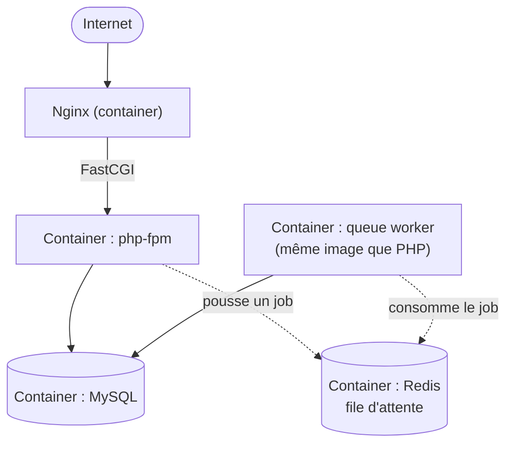

# Chapitre 22 — Étude de cas : Laravel + Docker

**Niveau : Intermédiaire → Avancé**

---

## Introduction

Cette étude de cas conteneurise Laravel — un cas plus complexe que Next.js (chapitre 21) car une application Laravel classique repose sur **trois** process distincts travaillant ensemble : php-fpm (exécute le code), nginx (sert les requêtes), et un worker de file d'attente (chapitre 6, section 6.9). Ce chapitre montre comment Docker Compose orchestre cette pluralité de process bien plus naturellement qu'une installation directe avec plusieurs services systemd séparés.

## 🎯 Objectifs pédagogiques

Déployer une application Laravel complète — web et worker de file d'attente — entièrement via Docker Compose, avec MySQL.

## 📋 Prérequis

Chapitres 7, 8 (Docker, Compose). Chapitre 6, section 6.9 (Laravel direct, pour comparaison).

## Pourquoi ce chapitre est important

Laravel illustre un cas où Docker Compose apporte un bénéfice particulièrement net par rapport à l'installation directe : plutôt que de gérer manuellement php-fpm, nginx et un service systemd de worker séparément (chapitre 6), chaque rôle devient un container distinct, démarré et supervisé uniformément par une seule commande.

---

## Contexte du projet

**Brief.** Une boutique en ligne construite en Laravel, avec traitement asynchrone des emails de confirmation de commande via une file d'attente — le scénario typique qui justifie un worker séparé.


**Explication du diagramme :** contrairement au chapitre 21, nginx est ici **conteneurisé lui aussi** — cette étude de cas illustre la variante "tout dans Docker", complémentaire à celle du chapitre 21. Le worker de file d'attente partage la même image applicative que php-fpm, mais avec une commande de démarrage différente (`php artisan queue:work` plutôt que `php-fpm`).

---

## Explications détaillées

### 22.1 Dockerfile pour PHP/Laravel

```dockerfile
FROM php:8.3-fpm-alpine
WORKDIR /var/www
RUN docker-php-ext-install pdo_mysql
RUN apk add --no-cache composer
COPY composer.json composer.lock ./
RUN composer install --no-dev --optimize-autoloader --no-scripts
COPY . .
RUN composer dump-autoload --optimize
RUN chown -R www-data:www-data storage bootstrap/cache
USER www-data
CMD ["php-fpm"]
```
**Explication ligne par ligne :** `docker-php-ext-install pdo_mysql` installe l'extension PHP nécessaire pour parler à MySQL, absente de l'image de base minimale ; `composer install --no-scripts` évite d'exécuter des scripts Laravel qui supposeraient un environnement déjà configuré (base de données accessible, par exemple) au moment du **build**, alors qu'elle ne l'est qu'au **lancement** du container.

### 22.2 `docker-compose.yml` complet

```yaml
services:
  nginx:
    image: nginx:alpine
    ports:
      - "80:80"
    volumes:
      - ./:/var/www
      - ./docker/nginx.conf:/etc/nginx/conf.d/default.conf
    depends_on:
      - app
    restart: unless-stopped

  app:
    build: .
    volumes:
      - ./storage:/var/www/storage
    environment:
      DB_HOST: db
      DB_DATABASE: boutique
      DB_USERNAME: boutique_user
      DB_PASSWORD: ${DB_PASSWORD}
      QUEUE_CONNECTION: redis
      REDIS_HOST: cache
    depends_on:
      db:
        condition: service_healthy
    restart: unless-stopped

  worker:
    build: .
    command: php artisan queue:work --sleep=3 --tries=3
    environment:
      DB_HOST: db
      DB_DATABASE: boutique
      DB_USERNAME: boutique_user
      DB_PASSWORD: ${DB_PASSWORD}
      QUEUE_CONNECTION: redis
      REDIS_HOST: cache
    depends_on:
      db:
        condition: service_healthy
    restart: unless-stopped

  db:
    image: mysql:8
    environment:
      MYSQL_DATABASE: boutique
      MYSQL_USER: boutique_user
      MYSQL_PASSWORD: ${DB_PASSWORD}
      MYSQL_ROOT_PASSWORD: ${DB_ROOT_PASSWORD}
    volumes:
      - mysql-data:/var/lib/mysql
    healthcheck:
      test: ["CMD", "mysqladmin", "ping", "-h", "localhost"]
      interval: 5s
      retries: 5
    restart: unless-stopped

  cache:
    image: redis:7-alpine
    restart: unless-stopped

volumes:
  mysql-data:
```
**Décomposition du point le plus important :** `app` et `worker` partagent exactement la même image (`build: .`), mais `worker` **surcharge** la commande de démarrage (`command:`) — plutôt que `php-fpm` (exécuter à la demande), il lance `php artisan queue:work` (un process de longue durée qui consomme la file en continu). Un seul `Dockerfile`, deux rôles distincts selon la commande de lancement.

### 22.3 Configuration nginx conteneurisée

```nginx
# docker/nginx.conf
server {
    listen 80;
    root /var/www/public;
    index index.php;

    location / {
        try_files $uri $uri/ /index.php?$query_string;
    }
    location ~ \.php$ {
        fastcgi_pass app:9000;
        fastcgi_index index.php;
        include fastcgi_params;
        fastcgi_param SCRIPT_FILENAME $document_root$fastcgi_script_name;
    }
}
```
> 📌 **À retenir** — `fastcgi_pass app:9000` référence le **nom du service** Compose (`app`), exactement comme `proxy_pass http://app:3000` l'aurait fait pour un service Node (chapitre 21) — le même mécanisme de résolution de noms Docker (chapitre 7, section 7.7), appliqué ici au protocole FastCGI plutôt qu'HTTP.

### 22.4 Un reverse proxy externe devant tout ça

Ce nginx conteneurisé (port 80 interne au Compose) est lui-même placé derrière le nginx du système hôte, qui gère HTTPS — évitant de dupliquer la gestion Certbot à l'intérieur d'un container :
```nginx
# nginx du système hôte, /etc/nginx/sites-available/boutique
server {
    listen 80;
    server_name boutique.tondomaine.ht;
    location / {
        proxy_pass http://127.0.0.1:8080;   # le nginx conteneurisé, republié sur un port différent
    }
}
```
```yaml
# ajustement du docker-compose.yml
  nginx:
    ports:
      - "127.0.0.1:8080:80"   # au lieu de "80:80" directement
```

### 22.5 Migrations et sauvegardes

```bash
docker compose exec app php artisan migrate --force
```
```bash
docker compose exec -T db mysqldump -u boutique_user -p"${DB_PASSWORD}" boutique | gzip > backup.sql.gz
```

### 22.6 Checklist finale de mise en production

- [ ] `docker compose ps` montre `nginx`, `app`, `worker`, `db`, `cache` tous actifs.
- [ ] Une commande passée en test déclenche bien un job consommé par le `worker` (vérifiable dans `docker compose logs worker`).
- [ ] Le port du nginx conteneurisé n'est publié que sur `127.0.0.1` (rappel du chapitre 21).
- [ ] `APP_DEBUG=false` confirmé dans l'environnement du container `app`.

---

## Bonnes pratiques (récapitulatif du chapitre)

- Un seul Dockerfile pour `app` et `worker`, la commande de lancement seule les distingue.
- `composer install --no-scripts` au build, jamais de script supposant un environnement déjà vivant.
- Un nginx conteneurisé republié sur un port local, jamais directement sur Internet — le nginx du système hôte reste le seul point d'entrée public géré par Certbot.

## Erreurs fréquentes (récapitulatif du chapitre)

| Erreur | Pourquoi elle arrive | Conséquence |
|---|---|---|
| Oublier le service `worker` distinct | Confusion avec le service `app` | Les emails/jobs différés ne sont jamais traités |
| `fastcgi_pass` pointant sur `127.0.0.1:9000` au lieu de `app:9000` | Habitude d'une installation non conteneurisée | nginx ne trouve jamais php-fpm, 502 systématique |

---

## Captures d'écran à réaliser

> 📸 **Capture 25**
> **Logiciel :** terminal
> **Pourquoi cette capture est utile :** montrer les cinq services de la stack actifs simultanément.
> **Page/écran concerné :** `docker compose ps`
> **Montrer :** les cinq services avec leur statut

---

## Laboratoire pratique n°1 — Déployer la stack complète

**Objectifs :** reproduire l'intégralité de ce chapitre.

## Laboratoire pratique n°2 — Confirmer le fonctionnement du worker

**Objectifs :** déclencher un job en file d'attente et confirmer son traitement dans les logs du worker.

## Laboratoire pratique n°3 — Simuler l'arrêt du worker et observer l'accumulation de jobs

**Objectifs :** arrêter volontairement `worker` (`docker compose stop worker`), déclencher plusieurs jobs, observer leur accumulation, puis redémarrer le worker et confirmer leur traitement en rattrapage.

---

## Exercices

1. Pourquoi `app` et `worker` peuvent-ils partager la même image Docker malgré des rôles différents ?
2. Explique pourquoi `composer install` ne doit jamais exécuter de script supposant une base de données déjà accessible.
3. Pourquoi le nginx conteneurisé de ce chapitre n'est-il pas directement exposé sur Internet ?

## Quiz

**Question 1.** Le worker Laravel de ce chapitre se distingue du service `app` par :
a) Une image Docker complètement différente
b) Sa seule commande de démarrage (`command:` surchargée)
c) Un langage de programmation différent
d) Aucune différence réelle

> 🔑 **Corrigé** — 1: b

---

## 📝 Résumé du chapitre

Laravel, avec ses trois rôles process (web, worker, base), illustre un cas où Docker Compose orchestre naturellement une pluralité de services à partir d'une même base de code, chacun distingué par sa seule commande de lancement.

## ✅ Checklist avant de passer au chapitre 23

- [ ] J'ai déployé une stack Laravel complète avec worker séparé, entièrement conteneurisée.

---

## Glossaire du chapitre

**FastCGI**
Définition simple : le protocole qui permet à nginx de déléguer l'exécution du code PHP à php-fpm.
Définition technique : un protocole de communication entre un serveur web et un processus applicatif, utilisé ici entre le container nginx et le container php-fpm via le réseau Docker interne.
Voir : Chapitre 22, section 22.3.

## ❓ FAQ

**Pourquoi ne pas utiliser Laravel Sail (l'outil Docker officiel de Laravel) ?**
Sail est un excellent outil pour le développement local. Cette étude de cas construit sa propre configuration Compose pour rester cohérente avec la méthode enseignée depuis le chapitre 7 — Sail reste une option valable à explorer une fois cette base comprise.

## Références officielles

Laravel Deployment — [laravel.com/docs/deployment](https://laravel.com/docs/deployment)

## Conclusion

Le chapitre 23 quitte l'écosystème conteneurisé pour revenir à une installation directe, cette fois avec Python : Django et Gunicorn supervisés par systemd.

---

⬅️ [Chapitre 21 — Next.js + Prisma + Docker](21-etude-de-cas-nextjs-prisma-docker.md) · ➡️ **Suite : Chapitre 23 — Django + Gunicorn**
