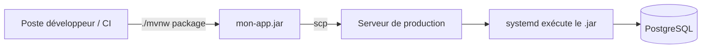

# Chapitre 24 — Étude de cas : Spring Boot

**Niveau : Intermédiaire**

---

## Introduction

Spring Boot (Java) illustre un cas particulier déjà annoncé au chapitre 6, section 6.11 : une application packagée en un **unique fichier exécutable** (`.jar`), sans dépendance externe autre que le runtime Java lui-même. Ce chapitre déroule ce cas jusqu'à la production, avec une attention particulière portée à l'endroit où la compilation doit avoir lieu.

## 🎯 Objectifs pédagogiques

Déployer une API Spring Boot en production, avec une stratégie de build en CI plutôt que sur le serveur, PostgreSQL et systemd.

## 📋 Prérequis

Chapitres 5 (section Java), 6 (section 6.11), 9, 10, 11, 12.

## Pourquoi ce chapitre est important

Spring Boot reste un standard de l'industrie pour des applications d'entreprise robustes. Ce chapitre illustre une bonne pratique cruciale déjà mentionnée mais jamais mise en œuvre jusqu'ici : compiler **ailleurs** que sur le serveur de production, une application Java pouvant consommer des ressources de compilation significatives.

---

## Contexte du projet

**Brief.** Une compagnie d'assurance a besoin d'une API de gestion de sinistres, l'équipe étant historiquement formée en Java/Spring — le choix technique découle de l'expertise existante, pas d'une contrainte du manuel.


**Explication du diagramme :** contrairement à toutes les études de cas précédentes, où le `build` a lieu **sur** le serveur cible (ou dans un container construit sur ce même serveur), Spring Boot est ici compilé **avant** tout transfert — le serveur de production ne reçoit jamais le code source, seulement l'artefact final.

---

## Explications détaillées

### 24.1 Préparer le serveur (Java uniquement, pas de JDK complet)

```bash
sudo apt install openjdk-21-jre-headless -y   # JRE seul, pas JDK — rappel chapitre 5
java -version
```
> 📌 **À retenir** — Puisque la compilation n'a jamais lieu sur ce serveur (section 24.1), seul le JRE (exécution) est nécessaire, jamais le JDK complet (compilation) — une différence directement issue du choix architectural de ce chapitre.

### 24.2 Builder le `.jar` en CI (chapitre 11)

```yaml
# .github/workflows/build.yml
name: Build Spring Boot
on:
  push:
    branches: [main]
jobs:
  build:
    runs-on: ubuntu-latest
    steps:
      - uses: actions/checkout@v4
      - uses: actions/setup-java@v4
        with:
          distribution: 'temurin'
          java-version: '21'
      - run: ./mvnw clean package -DskipTests=false
      - uses: actions/upload-artifact@v4
        with:
          name: mon-app-jar
          path: target/*.jar
```
`upload-artifact` conserve le `.jar` compilé comme résultat du pipeline, téléchargeable ou chaînable vers un job de déploiement ultérieur (chapitre 11, section 11.6, adapté ici au transfert d'un artefact plutôt qu'à un `git pull` sur le serveur).

### 24.3 Déploiement du `.jar` vers le serveur

```yaml
  deploy:
    needs: build
    runs-on: ubuntu-latest
    steps:
      - uses: actions/download-artifact@v4
        with: { name: mon-app-jar }
      - uses: appleboy/scp-action@v0.1.7
        with:
          host: ${{ secrets.SERVER_IP }}
          username: ${{ secrets.SERVER_USER }}
          key: ${{ secrets.DEPLOY_SSH_KEY }}
          source: "*.jar"
          target: "/home/jaslin/app/"
      - uses: appleboy/ssh-action@v1
        with:
          host: ${{ secrets.SERVER_IP }}
          username: ${{ secrets.SERVER_USER }}
          key: ${{ secrets.DEPLOY_SSH_KEY }}
          script: |
            mv /home/jaslin/app/*.jar /home/jaslin/app/mon-app.jar
            sudo systemctl restart assurance-api

```

### 24.4 Service systemd

```ini
# /etc/systemd/system/assurance-api.service
[Unit]
Description=Assurance API (Spring Boot)
After=network.target postgresql.service

[Service]
User=jaslin
Environment="SPRING_DATASOURCE_URL=jdbc:postgresql://localhost:5432/assurance"
Environment="SPRING_DATASOURCE_USERNAME=assurance_user"
Environment="SPRING_DATASOURCE_PASSWORD=MOT_DE_PASSE_REEL"
Environment="SPRING_PROFILES_ACTIVE=production"
ExecStart=/usr/bin/java -jar /home/jaslin/app/mon-app.jar
Restart=always
RestartSec=5

[Install]
WantedBy=multi-user.target
```
`SPRING_PROFILES_ACTIVE=production` active un fichier `application-production.properties` distinct du profil de développement — l'équivalent Spring Boot du `.env` de production distinct du `.env` local, déjà vu dans chaque étude de cas précédente sous une forme différente.

```bash
sudo systemctl daemon-reload
sudo systemctl enable --now assurance-api
```

### 24.5 Nginx et HTTPS

```nginx
server {
    listen 80;
    server_name assurance-api.tondomaine.ht;
    location / {
        proxy_pass http://localhost:8080;
        proxy_set_header Host $host;
        proxy_set_header X-Real-IP $remote_addr;
        proxy_set_header X-Forwarded-For $proxy_add_x_forwarded_for;
        proxy_set_header X-Forwarded-Proto $scheme;
    }
}
```
```bash
sudo certbot --nginx -d assurance-api.tondomaine.ht
```

### 24.6 Checklist finale de mise en production

- [ ] Le `.jar` est bien compilé en CI, jamais directement sur le serveur.
- [ ] `sudo systemctl status assurance-api` : "active (running)".
- [ ] `SPRING_PROFILES_ACTIVE=production` confirmé (jamais le profil par défaut de développement).
- [ ] Les identifiants de base de données ne sont jamais dans le `.jar` lui-même, uniquement en variables d'environnement systemd.

---

## Bonnes pratiques (récapitulatif du chapitre)

- Compiler en CI ou en local, jamais sur le serveur de production pour une application Java.
- `RestartSec` dans le service systemd, pour éviter une boucle de redémarrage trop rapide en cas de crash immédiat (contrairement à PM2, qui gère ce délai automatiquement).
- Un profil Spring dédié à la production, jamais le profil par défaut.

## Erreurs fréquentes (récapitulatif du chapitre)

| Erreur | Pourquoi elle arrive | Conséquence |
|---|---|---|
| Compiler directement sur le serveur de production | Habitude d'un déploiement plus simple en apparence | Consommation excessive de ressources pendant le build, ralentissement de l'application déjà en cours |
| Oublier `SPRING_PROFILES_ACTIVE` | Configuration par défaut supposée suffisante | Configuration de développement utilisée en production par erreur |

---

## Captures d'écran à réaliser

> 📸 **Capture 27**
> **Logiciel :** GitHub Actions
> **Pourquoi cette capture est utile :** montrer le pipeline en deux étapes (build puis déploiement de l'artefact).
> **Page/écran concerné :** détail de l'exécution du workflow
> **Montrer :** les jobs `build` et `deploy` successifs, avec l'artefact `.jar` transmis entre eux

---

## Laboratoire pratique n°1 — Déployer cette stack de bout en bout

## Laboratoire pratique n°2 — Construire le pipeline CI complet de compilation et déploiement

## Laboratoire pratique n°3 — Comparer le temps de compilation local vs sur un petit VPS

**Étapes :** compare le temps de `./mvnw package` sur ta machine de développement et, à titre d'expérience contrôlée, directement sur le VPS de production — observe l'impact sur les ressources partagées avec l'application déjà active.

---

## Exercices

1. Pourquoi ce chapitre installe-t-il uniquement le JRE, jamais le JDK, sur le serveur de production ?
2. Explique pourquoi `RestartSec` est pertinent dans ce service systemd, alors qu'il n'a jamais été nécessaire avec PM2.

## Quiz

**Question 1.** Dans cette étude de cas, où le fichier `.jar` est-il compilé ?
a) Sur le serveur de production, comme les études de cas précédentes
b) En CI, avant tout transfert vers le serveur
c) Il n'y a pas de compilation, Spring Boot s'exécute directement depuis le code source
d) Sur la machine de l'hébergeur, automatiquement

> 🔑 **Corrigé** — 1: b

---

## 📝 Résumé du chapitre

Spring Boot illustre la stratégie "compiler ailleurs, déployer un artefact figé" — une variante du schéma général particulièrement adaptée aux langages compilés dont la construction est coûteuse en ressources.

## ✅ Checklist avant de passer au chapitre 25

- [ ] J'ai un pipeline CI qui compile et transfère un artefact `.jar` vers le serveur de production.

---

## Glossaire du chapitre

**Artefact**
Définition simple : le résultat figé d'une compilation, prêt à être déployé.
Définition technique : un fichier binaire ou packagé (ici un `.jar`), produit par un processus de build, indépendant du code source qui l'a généré une fois produit.
Voir : Chapitre 24, section 24.2.

## ❓ FAQ

**Pourquoi ne pas conteneuriser Spring Boot avec Docker, comme au chapitre 21 ou 22 ?**
C'est une option tout à fait valide (une image `eclipse-temurin` avec le `.jar` copié dedans) — ce chapitre choisit délibérément l'installation directe pour varier les approches illustrées dans cette partie du manuel.

## Références officielles

Spring Boot — Deploying to Production — [docs.spring.io/spring-boot/reference/deployment](https://docs.spring.io/spring-boot/reference/deployment/index.html)

## Conclusion

Le chapitre 25 applique une stratégie de compilation similaire à l'écosystème .NET avec ASP.NET.

---

⬅️ [Chapitre 23 — Django + Gunicorn](23-etude-de-cas-django-gunicorn.md) · ➡️ **Suite : Chapitre 25 — ASP.NET**
