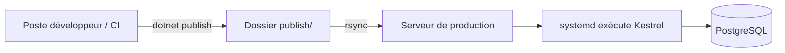

# Chapitre 25 — Étude de cas : ASP.NET

**Niveau : Intermédiaire**

---

## Introduction

Dernière étude de cas parmi les stacks "sur mesure" (les cinq suivantes couvrent des logiciels préexistants à installer plutôt que du code applicatif), ASP.NET Core complète le tour des principaux écosystèmes backend du marché. Comme Spring Boot (chapitre 24), il illustre le schéma "compiler ailleurs, déployer un artefact" — cette fois avec les spécificités de l'écosystème .NET, notamment son serveur intégré Kestrel.

## 🎯 Objectifs pédagogiques

Déployer une API ASP.NET Core en production, publiée en amont, exécutée par systemd derrière nginx.

## 📋 Prérequis

Chapitres 6 (section 6.12), 9, 10, 11, 12.

## Pourquoi ce chapitre est important

ASP.NET reste dominant dans de nombreuses entreprises historiquement construites sur l'écosystème Microsoft. Ce chapitre confirme, une dernière fois, que le schéma "reverse proxy + process supervisé" du manuel s'applique universellement, y compris à cet écosystème.

---

## Contexte du projet

**Brief.** Un cabinet d'avocats a besoin d'une API de gestion de dossiers, l'équipe étant déjà formée en C#/.NET.



---

## Explications détaillées

### 25.1 Installer le runtime .NET (exécution seulement)

```bash
wget https://dot.net/v1/dotnet-install.sh
chmod +x dotnet-install.sh
./dotnet-install.sh --channel LTS --runtime aspnetcore
echo 'export PATH=$PATH:$HOME/.dotnet' >> ~/.bashrc
source ~/.bashrc
```
> 📌 **À retenir** — Comme pour Java (chapitre 24), seul le runtime d'exécution est installé sur le serveur — le SDK complet de compilation n'y a jamais sa place, la compilation ayant lieu ailleurs (section 25.2).

### 25.2 Publier l'application (en local ou en CI)

```bash
dotnet publish -c Release -o ./publish
```
`-c Release` : compile en mode optimisé pour la production (par opposition à `Debug`, plus lent mais avec davantage d'informations de diagnostic — pertinent seulement en développement).

### 25.3 Transférer et configurer le service systemd

```bash
rsync -avz ./publish/ jaslin@ADRESSE_IP:~/app/publish/
```
```ini
# /etc/systemd/system/cabinet-api.service
[Unit]
Description=Cabinet API (ASP.NET Core)
After=network.target postgresql.service

[Service]
WorkingDirectory=/home/jaslin/app/publish
ExecStart=/home/jaslin/.dotnet/dotnet /home/jaslin/app/publish/CabinetApi.dll
Restart=always
RestartSec=5
User=jaslin
Environment=ASPNETCORE_ENVIRONMENT=Production
Environment=ASPNETCORE_URLS=http://localhost:5000
Environment=ConnectionStrings__Default=Host=localhost;Database=cabinet;Username=cabinet_user;Password=MOT_DE_PASSE_REEL

[Install]
WantedBy=multi-user.target
```
`ASPNETCORE_ENVIRONMENT=Production` charge `appsettings.Production.json` plutôt que `appsettings.Development.json` — l'équivalent exact, pour .NET, du `SPRING_PROFILES_ACTIVE` du chapitre 24 et du `.env` de production de chaque étude de cas précédente : trois écosystèmes différents, la même idée de séparation configuration dev/prod.

```bash
sudo systemctl daemon-reload
sudo systemctl enable --now cabinet-api
```

### 25.4 Nginx en reverse proxy vers Kestrel

```nginx
server {
    listen 80;
    server_name cabinet-api.tondomaine.ht;
    location / {
        proxy_pass http://localhost:5000;
        proxy_set_header Host $host;
        proxy_set_header X-Forwarded-For $proxy_add_x_forwarded_for;
        proxy_set_header X-Forwarded-Proto $scheme;
        proxy_set_header Upgrade $http_upgrade;
        proxy_set_header Connection keep-alive;
    }
}
```
> 📌 **À retenir** — `Upgrade`/`Connection keep-alive` sont ajoutés ici pour supporter SignalR (la bibliothèque de communication temps réel la plus courante dans l'écosystème ASP.NET, si utilisée) — un ajustement spécifique non nécessaire dans les études de cas précédentes, illustrant que le reverse proxy générique du chapitre 9 s'adapte parfois à des besoins précis d'un framework donné.

```bash
sudo certbot --nginx -d cabinet-api.tondomaine.ht
```

### 25.5 Checklist finale de mise en production

- [ ] `ASPNETCORE_ENVIRONMENT=Production` confirmé.
- [ ] La chaîne de connexion ne figure jamais dans un fichier committé, uniquement dans la configuration systemd.
- [ ] `sudo systemctl status cabinet-api` : "active (running)".
- [ ] Le SDK .NET complet n'est jamais installé sur le serveur de production, seul le runtime.

---

## Bonnes pratiques (récapitulatif du chapitre)

- `dotnet publish -c Release`, jamais `Debug`, pour tout déploiement de production.
- Runtime seul sur le serveur, jamais le SDK complet.
- Chaîne de connexion en variable d'environnement systemd, jamais dans `appsettings.json` committé.

## Erreurs fréquentes (récapitulatif du chapitre)

| Erreur | Pourquoi elle arrive | Conséquence |
|---|---|---|
| Publier en mode `Debug` par erreur | Oubli du flag `-c Release` | Performances dégradées, informations de diagnostic exposées |
| Chaîne de connexion committée dans `appsettings.json` | Réflexe de configuration statique | Secret exposé dans l'historique Git (rappel chapitre 3) |

---

## Captures d'écran à réaliser

> 📸 **Capture 28**
> **Logiciel :** terminal
> **Pourquoi cette capture est utile :** confirmer visuellement le contenu du dossier `publish/` transféré.
> **Page/écran concerné :** `ls -la ~/app/publish/` sur le serveur
> **Montrer :** le fichier `.dll` principal et ses dépendances

---

## Laboratoire pratique n°1 — Déployer cette stack de bout en bout

## Laboratoire pratique n°2 — Comparer une publication `Debug` vs `Release`

**Étapes :** publie les deux variantes, compare la taille du dossier généré et les informations exposées dans une réponse d'erreur volontairement provoquée.

## Laboratoire pratique n°3 — Automatiser la publication et le déploiement en CI

**Étapes :** construis un pipeline équivalent à celui du chapitre 24, adapté à `dotnet publish`.

---

## Exercices

1. Pourquoi `-c Release` est-il indispensable pour une publication de production ?
2. Explique le parallèle entre `ASPNETCORE_ENVIRONMENT`, `SPRING_PROFILES_ACTIVE` (chapitre 24) et le `.env` de production des études de cas Node.

## Quiz

**Question 1.** `ASPNETCORE_ENVIRONMENT=Production` sert à :
a) Activer le mode débogage
b) Charger la configuration de production plutôt que de développement
c) Installer automatiquement PostgreSQL
d) Générer le certificat SSL

> 🔑 **Corrigé** — 1: b

---

## 📝 Résumé du chapitre

ASP.NET Core, comme Spring Boot, confirme la stratégie de compilation externe et de déploiement d'un artefact figé, avec ses spécificités propres (Kestrel, `ASPNETCORE_ENVIRONMENT`) s'intégrant sans friction au schéma général du manuel.

## ✅ Checklist avant de passer au chapitre 26

- [ ] J'ai déployé une application ASP.NET Core publiée en mode `Release`, exécutée par systemd derrière nginx.

---

## Glossaire du chapitre

**Kestrel**
Définition simple : le serveur web intégré à ASP.NET Core.
Définition technique : un serveur HTTP multiplateforme léger, conçu pour tourner derrière un reverse proxy en production.
Voir : Chapitre 6, section 6.12 ; Chapitre 25, section 25.4.

## ❓ FAQ

**Faut-il un serveur Windows pour ASP.NET Core ?**
Non — ASP.NET Core (contrairement à l'ancien .NET Framework) est multiplateforme, exécutable nativement sur Ubuntu, comme démontré dans ce chapitre.

## Références officielles

ASP.NET Core — Host and deploy — [learn.microsoft.com/aspnet/core/host-and-deploy](https://learn.microsoft.com/en-us/aspnet/core/host-and-deploy/)

## Conclusion

Les trois études de cas suivantes changent de nature : plutôt que du code applicatif sur mesure, elles déploient des logiciels préexistants largement utilisés — en commençant, au chapitre 26, par le plus répandu au monde : WordPress.

---

⬅️ [Chapitre 24 — Spring Boot](24-etude-de-cas-spring-boot.md) · ➡️ **Suite : Chapitre 26 — WordPress**
