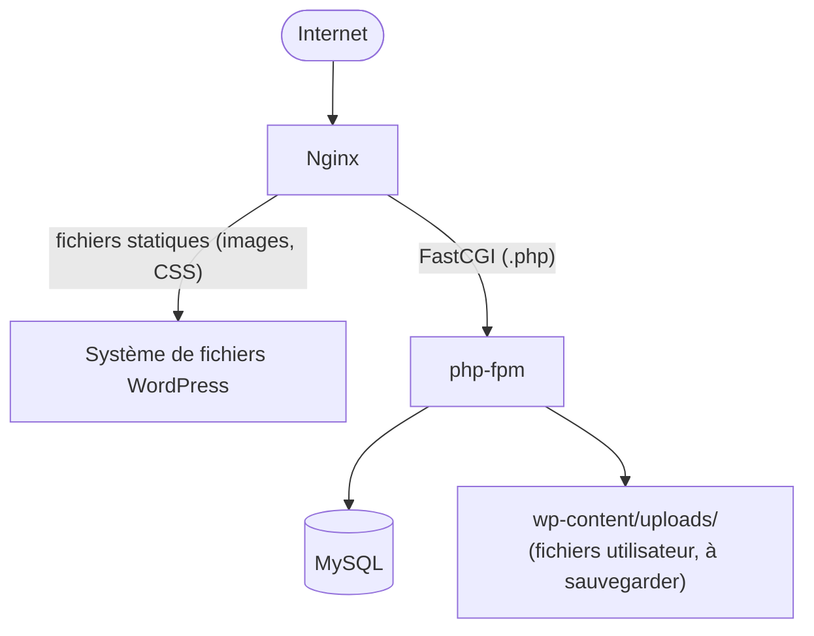

# Chapitre 26 — Étude de cas : WordPress

**Niveau : Intermédiaire**

---

## Introduction

Cette étude de cas change de nature par rapport aux précédentes : WordPress n'est pas du code applicatif écrit sur mesure, mais un logiciel préexistant, téléchargé et configuré — le scénario le plus fréquent pour un site vitrine ou un blog, largement plus répandu dans l'ensemble d'Internet que toutes les stacks sur mesure réunies. Ce chapitre applique les mêmes principes de sécurité et de sauvegarde du manuel à ce contexte différent.

## 🎯 Objectifs pédagogiques

Installer WordPress en production sur une stack LEMP (Linux, Nginx, MySQL, PHP), durci selon les principes de sécurité déjà enseignés, avec sauvegardes automatisées couvrant à la fois la base de données et les fichiers.

## 📋 Prérequis

Chapitres 4, 5 (PHP, MySQL, Nginx), 9, 10, 12, 15.

## Pourquoi ce chapitre est important

WordPress propulse une part très significative des sites web dans le monde, et sa popularité même en fait une cible privilégiée d'attaques automatisées. Un WordPress mal sécurisé (identifiants par défaut, fichiers en écriture excessive, absence de sauvegarde des fichiers uploadés) est l'un des types de compromissions les plus fréquentes sur Internet.

---

## Contexte du projet

**Brief.** Un restaurant veut un site vitrine avec un blog géré en interne par le personnel, sans compétence technique — WordPress, avec son éditeur visuel, est le choix naturel plutôt qu'un développement sur mesure.


**Explication du diagramme :** contrairement aux applications sur mesure du manuel, WordPress stocke une partie significative de son contenu **directement en fichiers** (`wp-content/uploads/`, thèmes, extensions) en plus de la base de données — une sauvegarde limitée à la seule base (comme suffisant pour les études de cas précédentes) serait ici gravement incomplète.

---

## Explications détaillées

### 26.1 Préparer le serveur et la stack LEMP (chapitres 4, 5)

```bash
sudo apt install nginx mysql-server php php-fpm php-mysql php-curl php-gd php-mbstring php-xml php-zip -y
sudo mysql_secure_installation
```

### 26.2 Base de données dédiée

```bash
sudo mysql -u root -p
```
```sql
CREATE DATABASE restaurant_wp;
CREATE USER 'wp_user'@'localhost' IDENTIFIED BY 'MOT_DE_PASSE_REEL';
GRANT ALL PRIVILEGES ON restaurant_wp.* TO 'wp_user'@'localhost';
FLUSH PRIVILEGES;
```

### 26.3 Télécharger et configurer WordPress

```bash
cd /var/www
sudo curl -O https://wordpress.org/latest.tar.gz
sudo tar -xzf latest.tar.gz
sudo mv wordpress restaurant
sudo chown -R www-data:www-data restaurant
cd restaurant
sudo cp wp-config-sample.php wp-config.php
sudo nano wp-config.php
```
```php
define('DB_NAME', 'restaurant_wp');
define('DB_USER', 'wp_user');
define('DB_PASSWORD', 'MOT_DE_PASSE_REEL');
define('DB_HOST', 'localhost');

// Clés de sécurité uniques — générées sur api.wordpress.org/secret-key/1.1/salt/
define('AUTH_KEY', '...');
// ... (8 clés au total)

define('DISALLOW_FILE_EDIT', true);   // interdit l'édition de fichiers depuis l'admin web
```
> ⚠️ **Attention** — `DISALLOW_FILE_EDIT` est une bonne pratique de sécurité essentielle : sans elle, quiconque compromet un compte administrateur WordPress peut modifier directement le code PHP du site depuis l'éditeur intégré de l'admin, un vecteur d'attaque fréquent une fois un accès initial obtenu. Les vraies modifications de thème doivent passer par Git (chapitre 3) et un déploiement contrôlé, jamais par cet éditeur web.

### 26.4 Nginx pour WordPress

```nginx
server {
    listen 80;
    server_name restaurant.ht;
    root /var/www/restaurant;
    index index.php;

    location / {
        try_files $uri $uri/ /index.php?$args;
    }
    location ~ \.php$ {
        include snippets/fastcgi-php.conf;
        fastcgi_pass unix:/var/run/php/php8.3-fpm.sock;
    }
    location ~* \.(jpg|jpeg|png|gif|css|js)$ {
        expires 30d;
    }
    location ~ /\. {
        deny all;   # bloque l'accès aux fichiers cachés (.git, .env s'il en existait un)
    }
    location = /wp-config.php {
        deny all;   # blocage explicite, en plus de la protection par défaut de nginx
    }
}
```
```bash
sudo certbot --nginx -d restaurant.ht -d www.restaurant.ht
```

### 26.5 Finaliser l'installation via le navigateur

Contrairement aux études de cas précédentes, l'étape finale de configuration WordPress (choix du titre du site, création du premier compte administrateur) se fait via un assistant web, en visitant le domaine.

> ✅ **Bonne pratique** — Choisir un nom d'utilisateur administrateur **différent** de `admin` (le nom le plus systématiquement tenté par les robots d'attaque automatisés) et un mot de passe fort et unique, jamais réutilisé d'un autre projet.

### 26.6 Durcissement spécifique à WordPress (chapitre 15, appliqué)

**Limiter les tentatives de connexion**, via une jail Fail2ban personnalisée (chapitre 15, section 15.3) :
```ini
# /etc/fail2ban/filter.d/wordpress.conf
[Definition]
failregex = ^<HOST> .* "POST /wp-login.php
```
```ini
# jail.local, ajout
[wordpress]
enabled = true
filter = wordpress
logpath = /var/log/nginx/access.log
maxretry = 5
findtime = 10m
bantime = 1h
```

**Désactiver l'énumération d'utilisateurs** (une faille classique de WordPress permettant de deviner les noms d'utilisateurs via une URL prévisible) — nécessite un plugin de sécurité dédié (comme Wordfence) ou une règle nginx bloquant le motif `?author=`.

### 26.7 Sauvegardes : base de données ET fichiers

```bash
nano ~/scripts/backup-wordpress.sh
```
```bash
#!/bin/bash
set -e
DATE=$(date +%Y-%m-%d_%H%M)
BACKUP_DIR="/var/backups/restaurant"
mkdir -p "$BACKUP_DIR"

# Base de données
mysqldump -u wp_user -p'MOT_DE_PASSE_REEL' --single-transaction restaurant_wp | gzip > "$BACKUP_DIR/db_$DATE.sql.gz"

# Fichiers uploadés (jamais uniquement la base, rappel de la section 26.0)
tar -czf "$BACKUP_DIR/uploads_$DATE.tar.gz" -C /var/www/restaurant/wp-content uploads

find "$BACKUP_DIR" -mtime +14 -delete
rclone copy "$BACKUP_DIR/db_$DATE.sql.gz" remote:Restaurant-Backups/
rclone copy "$BACKUP_DIR/uploads_$DATE.tar.gz" remote:Restaurant-Backups/
```
> ⚠️ **Attention, piège spécifique à WordPress absent des études de cas précédentes** — Sauvegarder uniquement la base de données (comme suffisant pour une application sur mesure typique) laisse de côté toutes les images et fichiers uploadés via l'éditeur, souvent le contenu le plus irremplaçable pour le client final (photos du restaurant, menus en PDF). Les deux sauvegardes sont indispensables, jamais l'une sans l'autre.

### 26.8 Checklist finale de mise en production

- [ ] `DISALLOW_FILE_EDIT` activé.
- [ ] Nom d'utilisateur administrateur différent de `admin`.
- [ ] Jail Fail2ban dédiée à `/wp-login.php` active.
- [ ] Sauvegarde couvrant à la fois la base de données ET `wp-content/uploads/`.
- [ ] `wp-config.php` inaccessible directement via une URL (`curl -I https://restaurant.ht/wp-config.php` doit répondre `403` ou `404`).

---

## Bonnes pratiques (récapitulatif du chapitre)

- `DISALLOW_FILE_EDIT` systématique, l'édition de code passe toujours par Git.
- Nom d'utilisateur admin jamais générique (`admin`).
- Sauvegarde des fichiers uploadés en plus de la base, sans exception.
- Extensions et thèmes installés uniquement depuis des sources officielles ou vérifiées, jamais un fichier trouvé au hasard en ligne.

## Erreurs fréquentes (récapitulatif du chapitre)

| Erreur | Pourquoi elle arrive | Conséquence |
|---|---|---|
| Sauvegarder uniquement la base de données | Réflexe hérité des études de cas précédentes | Perte définitive des images/fichiers uploadés en cas d'incident |
| Compte admin nommé `admin` | Simplicité au moment de l'installation | Cible facilitée pour les attaques par force brute automatisées |
| `DISALLOW_FILE_EDIT` non activé | Étape méconnue | Un compte admin compromis peut modifier directement le code PHP |

---

## Captures d'écran à réaliser

> 📸 **Capture 29**
> **Logiciel :** navigateur
> **Pourquoi cette capture est utile :** documenter l'assistant d'installation WordPress, une étape unique à ce chapitre.
> **Page/écran concerné :** l'écran final de configuration (titre du site, compte administrateur)
> **Montrer :** le formulaire de création du compte administrateur
> **Flouter/masquer :** le mot de passe choisi si visible à l'écran

---

## Laboratoire pratique n°1 — Installer WordPress de bout en bout

## Laboratoire pratique n°2 — Confirmer la protection de `wp-config.php` et du dossier caché

**Étapes :** tente d'accéder directement à `wp-config.php` et à un fichier `.git` fictif via l'URL, confirme le refus.

## Laboratoire pratique n°3 — Tester la jail Fail2ban dédiée à WordPress

**Étapes :** provoque plusieurs échecs de connexion sur `/wp-login.php` depuis une IP de test, confirme le bannissement.

---

## Exercices

1. Pourquoi une sauvegarde de base de données seule est-elle insuffisante pour WordPress, contrairement à la plupart des études de cas précédentes ?
2. Explique le risque concret que `DISALLOW_FILE_EDIT` prévient.
3. Pourquoi un compte administrateur nommé `admin` est-il une mauvaise pratique spécifiquement pour WordPress ?

## Quiz

**Question 1.** `DISALLOW_FILE_EDIT` dans `wp-config.php` sert à :
a) Empêcher toute mise à jour de WordPress
b) Interdire l'édition de fichiers PHP depuis l'interface d'administration web
c) Bloquer l'upload d'images
d) Désactiver les commentaires

> 🔑 **Corrigé** — 1: b

---

## 📝 Résumé du chapitre

WordPress applique les mêmes principes de sécurité et de sauvegarde que le reste du manuel, avec deux particularités : une part significative du contenu vit en fichiers (pas seulement en base), et sa popularité en fait une cible privilégiée nécessitant un durcissement spécifique (comptes, jails Fail2ban dédiées).

## ✅ Checklist avant de passer au chapitre 27

- [ ] J'ai installé WordPress avec `DISALLOW_FILE_EDIT`, un compte admin non générique, et une sauvegarde couvrant base + fichiers.

---

## Glossaire du chapitre

**LEMP**
Définition simple : la variante de la stack LAMP utilisant Nginx plutôt qu'Apache.
Définition technique : Linux, nginx (E pour *Engine-x*), MySQL, PHP — l'acronyme désignant l'ensemble des composants nécessaires à l'exécution de WordPress dans ce manuel.
Voir : Chapitre 26, introduction.

## ❓ FAQ

**Faut-il utiliser un hébergement WordPress spécialisé plutôt que ce déploiement manuel ?**
Les deux sont valables. Un hébergement spécialisé simplifie certaines tâches (mises à jour automatiques, cache pré-configuré) au prix d'un contrôle réduit — ce chapitre choisit la voie manuelle pour rester cohérent avec le reste du manuel et garder un contrôle total.

## Références officielles

WordPress Codex — Hardening WordPress — [wordpress.org/documentation/article/hardening-wordpress](https://wordpress.org/documentation/article/hardening-wordpress/)

## Conclusion

Le chapitre 27 poursuit avec un logiciel préexistant nettement plus complexe : ERPNext, une suite de gestion d'entreprise complète.

---

⬅️ [Chapitre 25 — ASP.NET](25-etude-de-cas-aspnet.md) · ➡️ **Suite : Chapitre 27 — ERPNext**
