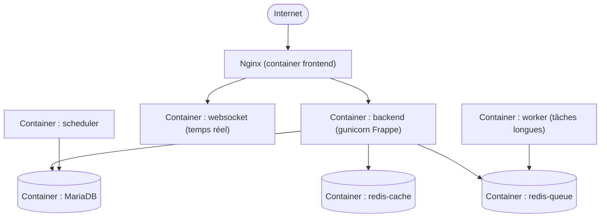

# Chapitre 27 — Étude de cas : ERPNext

**Niveau : Avancé**

---

## Introduction

ERPNext est une suite de gestion d'entreprise complète (comptabilité, stocks, ventes, ressources humaines), bâtie sur **Frappe**, un framework Python maison à l'architecture multi-services bien plus riche que les applications précédentes de ce manuel. Ce chapitre est volontairement classé "Avancé" : il mobilise simultanément Docker Compose (chapitre 8), plusieurs bases de données/caches, et une notion nouvelle — un système multi-tenant natif appelé "site" dans le vocabulaire Frappe.

## 🎯 Objectifs pédagogiques

Déployer ERPNext en production via la stack Docker officielle, créer un premier site, et sécuriser l'ensemble selon les principes déjà appris.

## 📋 Prérequis

Chapitres 7, 8 (Docker, Compose) impérativement maîtrisés. Chapitre 9, 10, 16.

## Pourquoi ce chapitre est important

ERPNext illustre un cas très réaliste pour une mission freelance : un client demande un ERP complet, et la meilleure réponse n'est presque jamais de le recoder depuis zéro, mais de déployer et configurer un logiciel mature existant — une compétence de déploiement distincte de celle de développement, tout aussi précieuse professionnellement.

---

## Contexte du projet

**Brief.** Une PME de distribution veut centraliser stocks, ventes et comptabilité. ERPNext, open source et complet, répond au besoin sans développement sur mesure.


**Explication du diagramme :** contrairement à toutes les études de cas précédentes, ERPNext sépare nativement les rôles en **plusieurs containers spécialisés** : un scheduler (tâches planifiées, l'équivalent applicatif de cron), un worker (traitement asynchrone, comme le worker Laravel du chapitre 22, mais natif à Frappe plutôt qu'ajouté), et deux instances Redis distinctes (une pour le cache, une pour les files d'attente) plutôt qu'une seule partagée.

---

## Explications détaillées

### 27.1 Préparer le serveur

```bash
curl -fsSL https://get.docker.com -o get-docker.sh
sudo sh get-docker.sh
sudo usermod -aG docker $USER
sudo apt install nginx certbot python3-certbot-nginx -y
```
> 📌 **À retenir** — Comme au chapitre 21, nginx reste ici hors Docker sur le système hôte, en reverse proxy vers le nginx conteneurisé de la stack ERPNext elle-même — deux couches nginx, chacune avec un rôle distinct (Certbot pour l'externe, routage interne Frappe pour l'interne).

### 27.2 Récupérer la configuration Docker officielle

```bash
git clone https://github.com/frappe/frappe_docker.git ~/erpnext
cd ~/erpnext
cp example.env .env
nano .env
```
```
ERPNEXT_VERSION=version-15
DB_PASSWORD=MOT_DE_PASSE_REEL
```

### 27.3 Démarrer la stack

```bash
docker compose -f pwd.yml up -d
```
**Ce que fait cette commande :** démarre l'ensemble des containers du diagramme ci-dessus, orchestrés par un `docker-compose.yml` officiel déjà préparé par le projet Frappe — un exemple concret de stack Compose bien plus élaborée que celles écrites à la main dans les chapitres précédents, mais reposant exactement sur les mêmes concepts (services, réseau, volumes, healthchecks) déjà maîtrisés.

### 27.4 Créer le premier site (notion propre à Frappe)

Un "site" Frappe est l'équivalent d'un tenant applicatif — une seule installation ERPNext peut héberger plusieurs sites indépendants, chacun avec ses propres données, similaire dans l'esprit au multi-tenant déjà rencontré ailleurs dans ce portefeuille de projets, mais géré nativement par le framework plutôt que construit sur mesure.

```bash
docker compose -f pwd.yml exec backend bench new-site pme-distribution.local \
  --mariadb-root-password MOT_DE_PASSE_REEL \
  --admin-password MOT_DE_PASSE_ADMIN \
  --install-app erpnext
```
`bench` est l'outil en ligne de commande natif de Frappe, exécuté **à l'intérieur** du container `backend` (rappel du chapitre 8, section 8.6 — `docker compose exec`) — il crée la base de données du site, applique les migrations, et installe l'application ERPNext elle-même sur ce site.

### 27.5 Nginx externe en reverse proxy

```nginx
server {
    listen 80;
    server_name erp.tondomaine.ht;
    location / {
        proxy_pass http://127.0.0.1:8080;   # le nginx conteneurisé de la stack ERPNext
        proxy_set_header Host $host;
        proxy_set_header X-Real-IP $remote_addr;
        proxy_set_header X-Forwarded-For $proxy_add_x_forwarded_for;
        proxy_set_header X-Forwarded-Proto $scheme;
    }
    location /socket.io {
        proxy_pass http://127.0.0.1:9000;   # le container websocket, pour le temps réel
        proxy_http_version 1.1;
        proxy_set_header Upgrade $http_upgrade;
        proxy_set_header Connection "upgrade";
    }
}
```
```bash
sudo certbot --nginx -d erp.tondomaine.ht
```

### 27.6 Sauvegardes natives Frappe

```bash
docker compose -f pwd.yml exec backend bench --site pme-distribution.local backup --with-files
```
`--with-files` inclut les fichiers uploadés (factures scannées, pièces jointes) en plus de la base de données — même principe de vigilance que pour WordPress (chapitre 26), Frappe gérant nativement cette double sauvegarde via son propre outil plutôt qu'un script maison.

```bash
nano ~/scripts/backup-erpnext.sh
```
```bash
#!/bin/bash
set -e
docker compose -f /home/jaslin/erpnext/pwd.yml exec -T backend \
  bench --site pme-distribution.local backup --with-files
# Les fichiers de sauvegarde sont générés dans le volume du site — à copier vers le stockage distant
docker compose -f /home/jaslin/erpnext/pwd.yml exec -T backend \
  find sites/pme-distribution.local/private/backups -mtime -1 -exec rclone copy {} remote:ERPNext-Backups/ \;
```

### 27.7 Checklist finale de mise en production

- [ ] Tous les containers de la stack (`docker compose ps`) sont actifs.
- [ ] Le site créé est accessible via `https://erp.tondomaine.ht`, cadenas fermé.
- [ ] Le mot de passe administrateur initial a été changé depuis l'interface.
- [ ] Une sauvegarde `--with-files` a été prise et son contenu vérifié.
- [ ] Le port MariaDB n'est exposé sur aucune interface publique (rappel du chapitre 21).

---

## Bonnes pratiques (récapitulatif du chapitre)

- Toujours `--with-files` pour les sauvegardes Frappe, jamais la base seule.
- Utiliser la configuration Docker officielle du projet plutôt que de reconstruire une stack Compose depuis zéro — un logiciel de cette complexité bénéficie de la maintenance communautaire de sa configuration de référence.
- Changer immédiatement le mot de passe administrateur initial défini en ligne de commande.

## Erreurs fréquentes (récapitulatif du chapitre)

| Erreur | Pourquoi elle arrive | Conséquence |
|---|---|---|
| Sauvegarde sans `--with-files` | Réflexe hérité d'une sauvegarde base-seule | Pièces jointes et fichiers perdus en cas d'incident |
| Oublier le routage `/socket.io` dans nginx | Fonctionnalité temps réel non anticipée | Notifications et mises à jour en direct de l'interface ne fonctionnent pas |
| Un seul site pensé comme suffisant alors que plusieurs entités le nécessitent | Méconnaissance du concept de site Frappe | Données de plusieurs entités mélangées dans un seul site, au lieu d'être isolées |

---

## Captures d'écran à réaliser

> 📸 **Capture 30**
> **Logiciel :** navigateur
> **Pourquoi cette capture est utile :** montrer l'interface ERPNext fonctionnelle après le premier déploiement.
> **Page/écran concerné :** le tableau de bord ERPNext après connexion administrateur
> **Flouter/masquer :** toute donnée métier réelle si le déploiement dépasse le cadre du test

---

## Laboratoire pratique n°1 — Déployer ERPNext de bout en bout

## Laboratoire pratique n°2 — Créer un second site sur la même installation

**Étapes :** `bench new-site` avec un second nom, confirme l'isolation des données entre les deux sites.

## Laboratoire pratique n°3 — Réaliser une sauvegarde et la restaurer sur un site de test

**Étapes :** `bench backup --with-files`, puis `bench restore` (documenté dans la référence officielle) vers un nouveau site de test — rappel du principe central du chapitre 12 et 16, appliqué à l'outil natif de Frappe.

---

## Exercices

1. Qu'est-ce qu'un "site" dans le vocabulaire Frappe, et à quel concept déjà rencontré dans ce manuel peut-on le comparer ?
2. Pourquoi ERPNext utilise-t-il deux instances Redis distinctes plutôt qu'une seule partagée ?
3. Pourquoi la configuration Docker officielle du projet est-elle préférable à une reconstruction manuelle pour un logiciel de cette complexité ?

## Quiz

**Question 1.** `bench` est :
a) Un serveur web
b) L'outil en ligne de commande natif de Frappe, exécuté dans le container backend
c) Un système de sauvegarde tiers
d) Un client de base de données

> 🔑 **Corrigé** — 1: b

---

## 📝 Résumé du chapitre

ERPNext, déployé via la stack Docker officielle de Frappe, illustre un cas de complexité supérieure (multiples services spécialisés, notion de site) tout en restant fondé sur les mêmes concepts Docker Compose déjà maîtrisés — la complexité vient de l'ampleur de l'orchestration, jamais de nouveaux principes.

## ✅ Checklist avant de passer au chapitre 28

- [ ] J'ai déployé ERPNext, créé un site, et réalisé une sauvegarde avec fichiers.

---

## Glossaire du chapitre

**Site (Frappe)**
Définition simple : une installation ERPNext isolée, avec ses propres données.
Définition technique : une unité multi-tenant native au framework Frappe, chacune disposant de sa propre base de données au sein d'une même installation applicative partagée.
Voir : Chapitre 27, section 27.4.

**Bench**
Définition simple : l'outil en ligne de commande de Frappe pour administrer sites et applications.
Définition technique : un utilitaire CLI Python gérant le cycle de vie des sites Frappe (création, sauvegarde, restauration, migration).
Voir : Chapitre 27, section 27.4.

## ❓ FAQ

**ERPNext peut-il être installé sans Docker, comme les études de cas 19, 20, 23 ?**
Oui, via une installation "bench" directe — mais nettement plus complexe à maintenir manuellement compte tenu du nombre de services impliqués. La voie Docker officielle est recommandée par le projet lui-même pour cette raison.

## Références officielles

Frappe Docker — [github.com/frappe/frappe_docker](https://github.com/frappe/frappe_docker)
ERPNext Documentation — [docs.erpnext.com](https://docs.erpnext.com)

## Conclusion

Le chapitre 28, dernier du manuel, applique une dernière fois ces principes à Odoo, un ERP concurrent avec sa propre architecture.

---

⬅️ [Chapitre 26 — WordPress](26-etude-de-cas-wordpress.md) · ➡️ **Suite : Chapitre 28 — Odoo**
