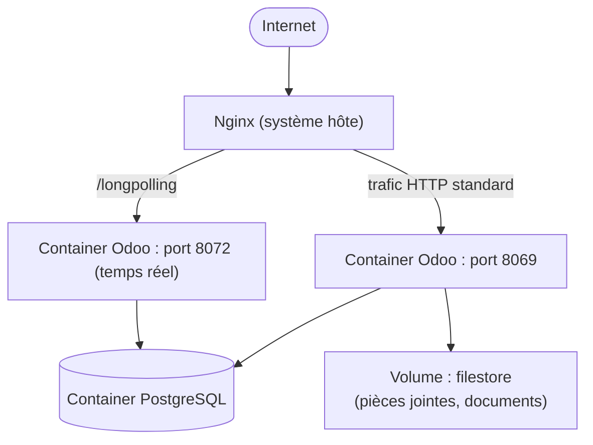

# Chapitre 28 — Étude de cas : Odoo

**Niveau : Avancé**

---

## Introduction

Dernière étude de cas de ce manuel, Odoo est — avec ERPNext (chapitre 27) — l'autre grand ERP open source du marché, avec une architecture sensiblement plus simple à opérer : un unique process Python (extensible en workers) devant PostgreSQL, plutôt que la constellation de containers spécialisés de Frappe. Ce choix d'architecture différent, pour un besoin métier comparable, est en soi la dernière leçon de ce manuel : deux logiciels matures peuvent résoudre le même problème avec des philosophies de déploiement distinctes, toutes deux légitimes.

## 🎯 Objectifs pédagogiques

Déployer Odoo en production via Docker Compose, avec PostgreSQL, gestion multi-base native, sauvegardes complètes (base et filestore), et exposition correcte de son canal de communication temps réel (longpolling).

## 📋 Prérequis

Chapitres 7, 8, 9, 10, 12, 16. Chapitre 27 utile en comparaison, non strictement requis.

## Pourquoi ce chapitre est important

Ce chapitre clôt le manuel sur une note délibérée : après vingt-sept chapitres à construire une méthode générale, celui-ci l'applique une dernière fois à un logiciel jamais rencontré, en s'appuyant uniquement sur la documentation officielle et les principes déjà acquis — exactement la situation dans laquelle tu te trouveras face à un logiciel réellement nouveau, une fois ce manuel terminé.

---

## Contexte du projet

**Brief.** Une coopérative agricole veut un système de gestion intégré (achats, ventes, inventaire, comptabilité) pour plusieurs de ses antennes régionales, chacune avec ses propres données — un besoin de séparation par base de données plutôt qu'un multi-tenant applicatif construit sur mesure.


**Explication du diagramme :** contrairement à ERPNext qui sépare chaque rôle en container distinct, Odoo fonctionne comme **un seul service applicatif** exposant deux ports différents depuis le même processus — le port standard (8069) pour l'interface classique, et un port dédié (8072) pour le "longpolling", le mécanisme par lequel Odoo simule des mises à jour en temps réel (chat interne, notifications) sans WebSocket natif dans les versions les plus répandues.

---

## Explications détaillées

### 28.1 Préparer le serveur

```bash
curl -fsSL https://get.docker.com -o get-docker.sh
sudo sh get-docker.sh
sudo usermod -aG docker $USER
sudo apt install nginx certbot python3-certbot-nginx -y
```

### 28.2 `docker-compose.yml`

```yaml
services:
  odoo:
    image: odoo:17
    ports:
      - "127.0.0.1:8069:8069"
      - "127.0.0.1:8072:8072"
    volumes:
      - odoo-web-data:/var/lib/odoo       # filestore, pièces jointes
      - ./config:/etc/odoo
    environment:
      HOST: db
      USER: odoo
      PASSWORD: ${DB_PASSWORD}
    depends_on:
      db:
        condition: service_healthy
    restart: unless-stopped

  db:
    image: postgres:16-alpine
    environment:
      POSTGRES_USER: odoo
      POSTGRES_PASSWORD: ${DB_PASSWORD}
      POSTGRES_DB: postgres
    volumes:
      - odoo-db-data:/var/lib/postgresql/data
    healthcheck:
      test: ["CMD", "pg_isready", "-U", "odoo"]
      interval: 5s
      retries: 5
    restart: unless-stopped

volumes:
  odoo-web-data:
  odoo-db-data:
```
> 📌 **À retenir** — `POSTGRES_DB: postgres` (la base administrative par défaut, pas une base applicative) est volontaire : Odoo crée lui-même ses propres bases de données, une par coopérative régionale dans le contexte de ce projet (section 28.4) — le rôle PostgreSQL `odoo` doit simplement avoir le droit d'en créer de nouvelles, pas posséder une base préexistante unique.

```bash
mkdir -p config
nano config/odoo.conf
```
```ini
[options]
admin_passwd = MOT_DE_PASSE_MAITRE_REEL
proxy_mode = True
```
`proxy_mode = True` indique à Odoo qu'il tourne derrière un reverse proxy (nginx) — sans ce réglage, Odoo ignorerait les en-têtes `X-Forwarded-*` (chapitre 9, section 9.4) et générerait des liens internes incorrects (`http://` au lieu de `https://`, adresse IP interne au lieu du vrai domaine).

```bash
echo "DB_PASSWORD=$(openssl rand -hex 16)" > .env
docker compose up -d
```

### 28.3 Nginx avec routage du longpolling

```nginx
server {
    listen 80;
    server_name cooperative.tondomaine.ht;

    location / {
        proxy_pass http://127.0.0.1:8069;
        proxy_set_header Host $host;
        proxy_set_header X-Real-IP $remote_addr;
        proxy_set_header X-Forwarded-For $proxy_add_x_forwarded_for;
        proxy_set_header X-Forwarded-Proto $scheme;
        proxy_read_timeout 720s;
    }
    location /longpolling {
        proxy_pass http://127.0.0.1:8072;
        proxy_set_header Host $host;
        proxy_set_header X-Forwarded-For $proxy_add_x_forwarded_for;
        proxy_set_header X-Forwarded-Proto $scheme;
        proxy_read_timeout 720s;
    }
}
```
> ⚠️ **Attention, piège spécifique à Odoo** — Sans ce routage précis vers le port 8072 pour `/longpolling`, les notifications en temps réel et le chat interne d'Odoo restent silencieusement non fonctionnels, sans erreur explicite pour l'utilisateur — juste une interface qui semble "figée", exactement le type de panne difficile à diagnostiquer sans connaître cette spécificité, rappelant la méthode du chapitre 18 : toujours vérifier la documentation officielle d'un logiciel inconnu pour ce type de configuration réseau non standard.

```bash
sudo certbot --nginx -d cooperative.tondomaine.ht
```

### 28.4 Créer une base de données par antenne régionale

Contrairement à ERPNext (un site = une commande `bench`), Odoo crée ses bases directement depuis l'interface web à la première visite (`https://cooperative.tondomaine.ht`), ou en ligne de commande :

```bash
docker compose exec odoo odoo --db_host=db --db_user=odoo --db_password="$DB_PASSWORD" \
  -d antenne_nord --init=base --stop-after-init
```
`-d antenne_nord` crée une nouvelle base nommée pour cette antenne ; `--init=base --stop-after-init` installe le module de base puis arrête proprement (utile pour un provisionnement scripté plutôt que via l'assistant web).

> ✅ **Bonne pratique** — Une fois plusieurs bases créées, restreindre l'accès via `dbfilter` dans `odoo.conf` (`dbfilter = ^antenne_nord$` pour un sous-domaine dédié à une seule antenne) évite qu'un utilisateur ne se retrouve, par erreur, face à un sélecteur listant toutes les bases de toutes les antennes.

### 28.5 Sauvegardes : base ET filestore

```bash
nano ~/scripts/backup-odoo.sh
```
```bash
#!/bin/bash
set -e
DATE=$(date +%Y-%m-%d_%H%M)
BACKUP_DIR="/var/backups/cooperative"
mkdir -p "$BACKUP_DIR"

docker compose -f /home/jaslin/odoo/docker-compose.yml exec -T db \
  pg_dump -U odoo antenne_nord | gzip > "$BACKUP_DIR/antenne_nord_$DATE.sql.gz"

docker run --rm -v odoo_odoo-web-data:/data -v "$BACKUP_DIR":/backup alpine \
  tar -czf "/backup/filestore_$DATE.tar.gz" -C /data .

find "$BACKUP_DIR" -mtime +14 -delete
rclone copy "$BACKUP_DIR/antenne_nord_$DATE.sql.gz" remote:Cooperative-Backups/
rclone copy "$BACKUP_DIR/filestore_$DATE.tar.gz" remote:Cooperative-Backups/
```
**Ce que fait la commande `docker run --rm` :** un container Alpine temporaire et jetable (rappel du chapitre 7, section 7.2) monte le volume nommé du filestore Odoo en lecture, l'archive, puis se termine — une technique pour accéder au contenu d'un volume nommé depuis l'extérieur de son container habituel, sans jamais avoir à modifier le service `odoo` lui-même pour cette seule opération ponctuelle.

### 28.6 Checklist finale de mise en production

- [ ] `proxy_mode = True` confirmé dans `odoo.conf`.
- [ ] Le routage `/longpolling` fonctionnel — chat interne testé réellement, pas seulement supposé.
- [ ] `admin_passwd` (le mot de passe maître, distinct des mots de passe utilisateurs) changé de sa valeur par défaut.
- [ ] Sauvegarde couvrant base **et** filestore, testée en restauration.
- [ ] Les ports 8069/8072 ne sont jamais exposés au-delà de `127.0.0.1`.

---

## Bonnes pratiques (récapitulatif du chapitre)

- `proxy_mode = True` systématique dès qu'Odoo tourne derrière un reverse proxy.
- Router explicitement `/longpolling` vers le port 8072, jamais oublié.
- `dbfilter` pour cloisonner l'accès entre plusieurs bases/antennes.
- Sauvegarde base + filestore, jamais l'une sans l'autre — même vigilance que pour WordPress (chapitre 26) et ERPNext (chapitre 27).

## Erreurs fréquentes (récapitulatif du chapitre)

| Erreur | Pourquoi elle arrive | Conséquence |
|---|---|---|
| `/longpolling` non routé | Spécificité méconnue | Chat et notifications silencieusement non fonctionnels |
| `proxy_mode` non activé | Réglage propre à Odoo, non standard | Liens internes générés en HTTP ou avec une IP interne incorrecte |
| Toutes les antennes visibles dans le sélecteur de base | `dbfilter` non configuré | Confusion utilisateur, risque de saisie dans la mauvaise base |

---

## Captures d'écran à réaliser

> 📸 **Capture 31**
> **Logiciel :** navigateur
> **Pourquoi cette capture est utile :** confirmer visuellement le fonctionnement du chat temps réel, preuve que le longpolling est correctement routé.
> **Page/écran concerné :** l'interface de chat interne Odoo, message envoyé et reçu en direct
> **Flouter/masquer :** tout contenu de conversation réel

---

## Laboratoire pratique n°1 — Déployer Odoo de bout en bout

## Laboratoire pratique n°2 — Créer deux bases et configurer `dbfilter`

**Étapes :** crée deux bases de test, configure un sous-domaine par base via `dbfilter`, confirme l'isolement.

## Laboratoire pratique n°3 — Diagnostiquer un longpolling volontairement mal configuré

**Étapes :** retire temporairement le bloc `location /longpolling`, observe le chat non fonctionnel, applique la méthode du chapitre 18 pour diagnostiquer avant de relire la solution.

---

## Exercices

1. Compare l'architecture d'Odoo (ce chapitre) et d'ERPNext (chapitre 27) : quels choix de déploiement diffèrent, et pourquoi aucun des deux n'est "plus correct" que l'autre ?
2. Explique pourquoi `proxy_mode = True` est nécessaire, en la reliant à la notion d'en-têtes `X-Forwarded-*` du chapitre 9.
3. Pourquoi une sauvegarde Odoo incomplète (base seule) pose-t-elle le même risque que pour WordPress ou ERPNext ?

## Quiz

**Question 1.** Le port 8072 d'Odoo sert à :
a) L'interface d'administration
b) Le longpolling, pour les fonctionnalités temps réel
c) La connexion à PostgreSQL
d) Les sauvegardes automatiques

**Question 2.** `proxy_mode = True` est nécessaire parce que :
a) Odoo ne fonctionne pas sans reverse proxy
b) Sans lui, Odoo ignore les en-têtes X-Forwarded-* et génère des liens incorrects
c) C'est une exigence de licence
d) Cela active le chat interne

> 🔑 **Corrigé** — 1: b · 2: b

---

## 📝 Résumé du chapitre

Odoo, avec son architecture à process unique et son mécanisme de longpolling propre, referme cette série d'études de cas sur une note délibérée : la méthode de ce manuel — comprendre l'architecture, consulter la documentation officielle pour les spécificités, appliquer les principes déjà acquis (reverse proxy, sauvegardes complètes, sécurité réseau) — s'applique à n'importe quel logiciel, y compris ceux jamais rencontrés auparavant.

## ✅ Checklist avant de terminer le manuel

- [ ] J'ai déployé Odoo avec le longpolling correctement routé et testé.
- [ ] Je peux résumer, sans notes, l'ossature commune aux dix études de cas de la Partie X.

---

## Glossaire du chapitre

**Longpolling**
Définition simple : une technique simulant des mises à jour en temps réel sans WebSocket natif.
Définition technique : un mécanisme où le client maintient une requête HTTP ouverte jusqu'à ce que le serveur ait une donnée à transmettre, plutôt qu'une connexion persistante bidirectionnelle classique.
Voir : Chapitre 28, section 28.3.

**`dbfilter`**
Définition simple : un réglage qui limite les bases de données visibles selon le domaine d'accès.
Définition technique : une expression régulière appliquée au nom d'hôte de la requête entrante, filtrant la liste des bases Odoo proposées ou accessibles.
Voir : Chapitre 28, section 28.4.

## ❓ FAQ

**Pourquoi Odoo n'a-t-il pas de worker/scheduler séparés comme ERPNext ?**
Les versions récentes d'Odoo supportent un mode multi-workers (processus multiples au sein du même service, réglable dans `odoo.conf`) plutôt que des containers dédiés par rôle — une différence de philosophie d'architecture, pas une limitation fonctionnelle.

## Références officielles

Odoo Documentation — [odoo.com/documentation](https://www.odoo.com/documentation/17.0/)
Odoo Official Docker Image — [hub.docker.com/_/odoo](https://hub.docker.com/_/odoo)

## Conclusion

Cette étude de cas referme la Partie X et, avec elle, l'ensemble du corps du manuel. Vingt-huit chapitres, une seule méthode : comprendre avant d'agir, mesurer avant de corriger, sécuriser avant d'exposer. Le manuel se termine sur les annexes de référence rapide, le glossaire complet et l'index, à consulter au quotidien une fois cette méthode acquise.

---

⬅️ [Chapitre 27 — ERPNext](27-etude-de-cas-erpnext.md) · ➡️ **[Annexes, Glossaire et Index](README.md)**
